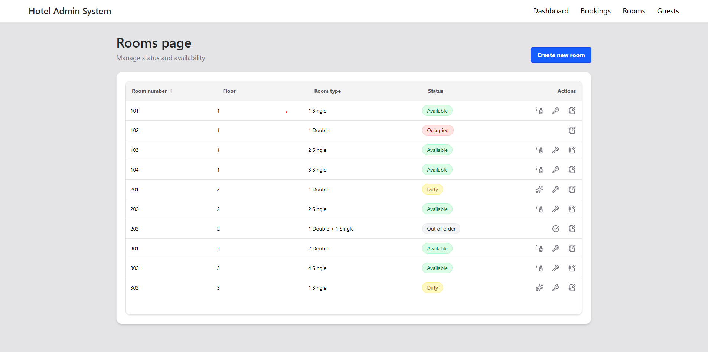
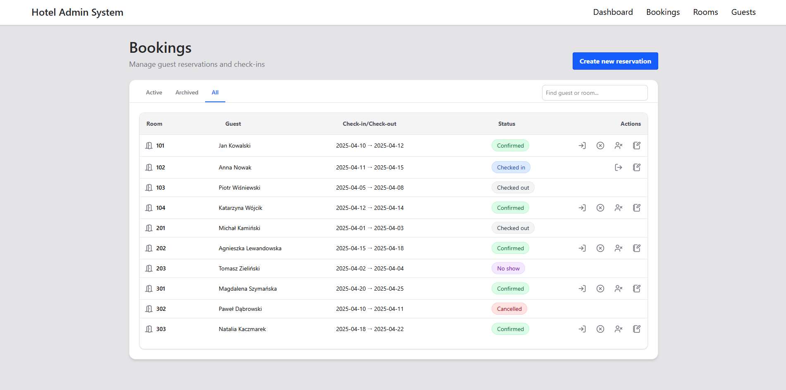
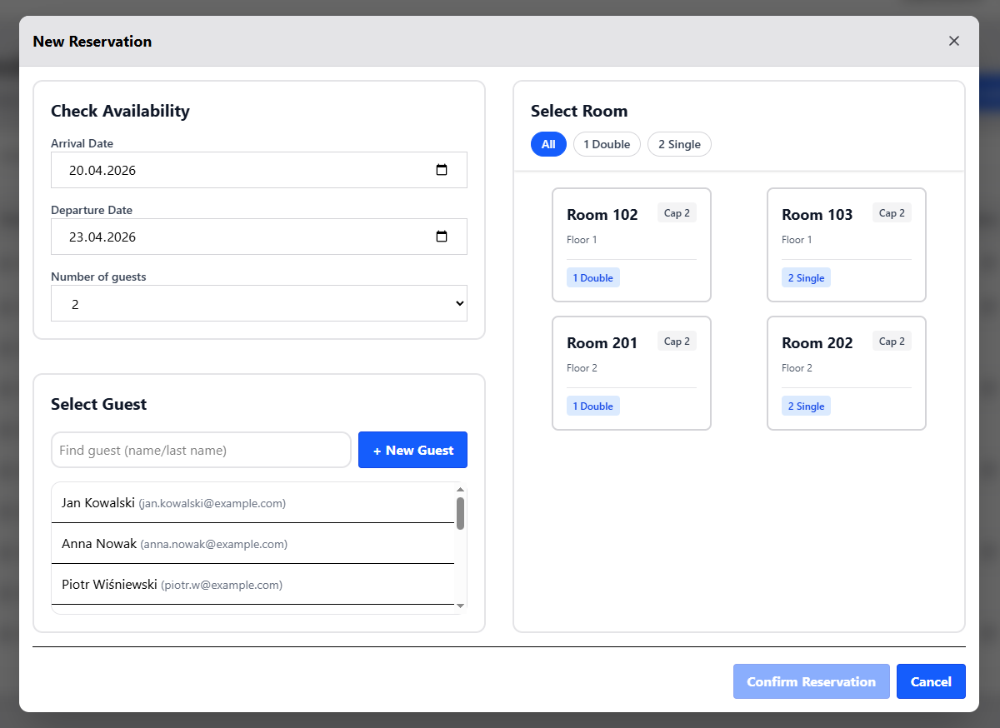
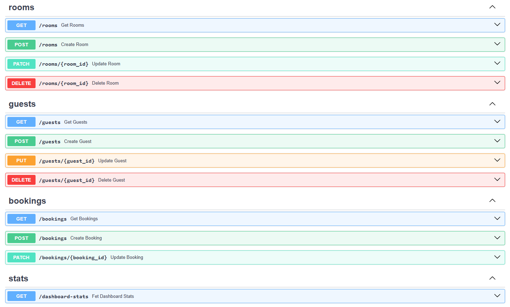

# Hotel Management Admin System


A full-stack hotel management admin panel built with **FastAPI** and **React**.  
The system allows hotel staff to manage **rooms, guests and bookings**, including operational workflows like **check-in, check-out, room cleaning and maintenance**.

> Built as a portfolio project to practice full-stack development with FastAPI, React and Docker.

## Screenshots





## Running with Docker
**Prerequisites:** Docker and Docker Compose must be installed.

1. Clone the repository:
```bash
git clone https://github.com/Wikuska/hotel-admin-system.git
cd hotel-admin-system
```

2. Start the application
```bash
docker-compose up -d --build
```

3. Access the System  
Once the containers are running and the database is seeded, open your browser:
```bash
Frontend UI: http://localhost:5173
Backend API Docs (Swagger): http://localhost:8000/docs
```
> No authentication required — the app opens directly.

4. Cleaning up
```bash
docker-compose down -v
```
<br>

## Features

## Booking management
- Create, edit and manage reservations
- Check-in / Check-out guests
- Mark bookings as cancelled or no-show
- Prevent double booking conflicts
- Automated room status updates based on booking status

## Room management
- View room availability and status
- Quick actions:
  - Mark room as dirty/cleaned
  - Start/Finish maintenance
- Status transition validation

## Guest management
- Store guest contact information
- Link guests to bookings

<br>

## Tech Stack

* **Backend:** FastAPI (Python 3.11), SQLAlchemy 2.0, Pydantic
* **Frontend:** React, Vite, Tailwind CSS
* **Database:** PostgreSQL 15
* **Infrastructure:** Docker & Docker Compose
